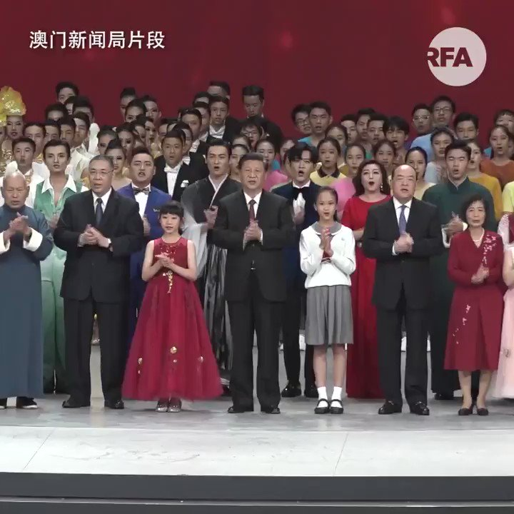

自由亚洲电台 北京时间 2019-12-20T15:59:15Z 1207933465175318528 【英籍“香港“第一先生” 拒绝拍掌的自由】
香港特首林郑月娥和丈夫林兆波，19日晚出席澳门庆回归文艺晚会。当台上的习近平跟一众高官拍手高唱  “歌唱祖国” 时，唯独台下的林兆波一个人没精打采，没有跟着唱，也没有跟着拍掌，跟旁边的张晓明、林郑月娥、王毅等人成强烈对比。
#香港第一先生
#林郑月娥 https://t.co/azBPPnNFH4   