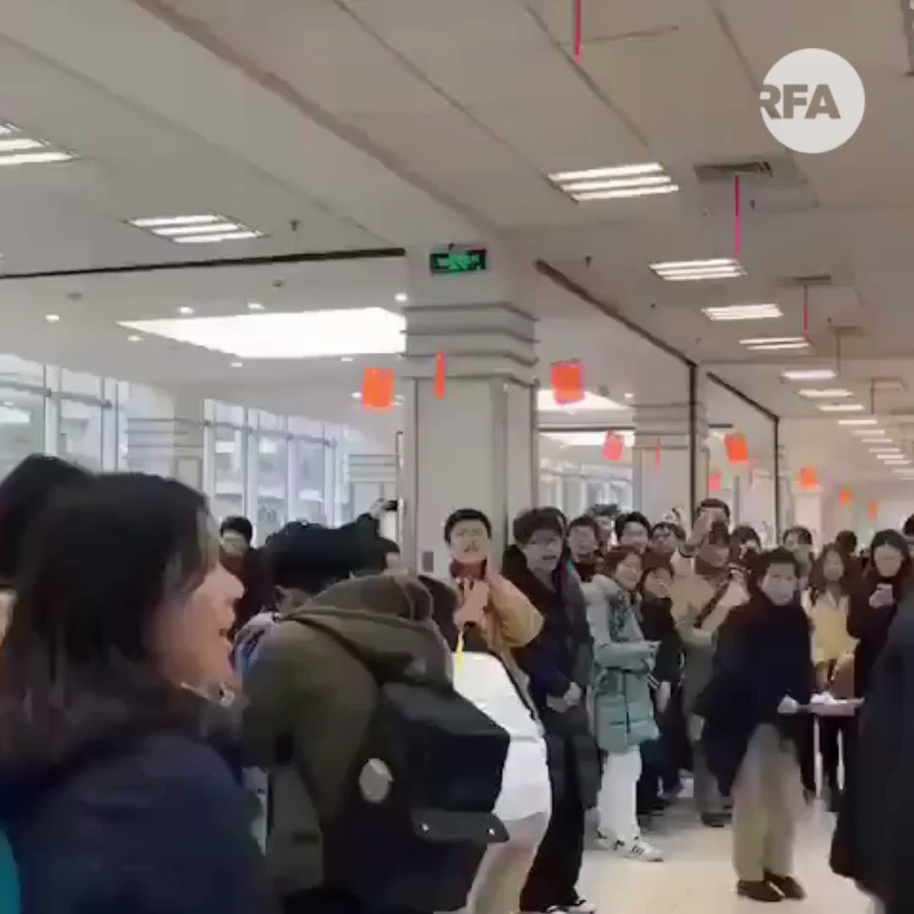

自由亚洲电台 北京时间 2019-12-18T14:41:36Z 1207189148706041857 【復旦修改大学章程删「学术独立、自由」字眼】
【师生不满聚集食堂高唱校歌表达不满】
上海復旦大学等多家高等学府近日相继修改大学章程，删除「独立之精神，自由之思想」等字眼。事件引起师生不满，在復旦食堂，有学生聚集，以唱校歌方式表达立场。其中两句歌词说："復旦復旦復旦，日月光华同灿烂" https://t.co/rfriv4ZXZi   