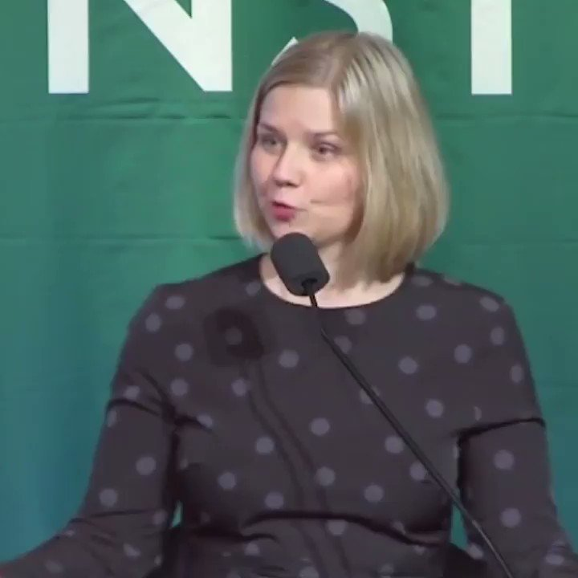

自由亚洲电台 北京时间 2019-10-16T16:07:25Z 1184380309946560512 【挪威议员提名全体香港人】
【竞逐 2020 诺贝尔和平奖】
挪威自由党成员 Guri Melby 在脸书发帖表示，已提名全体香港人竞逐 2020 年的诺贝尔和平奖，「因为他们正在争取自己的基本权利，例如言论自由、民主以及法治」。她又指香港人所做的远远超过为了香港本身，而且影响着世界其他地区。 https://t.co/TnyGSiFgda   