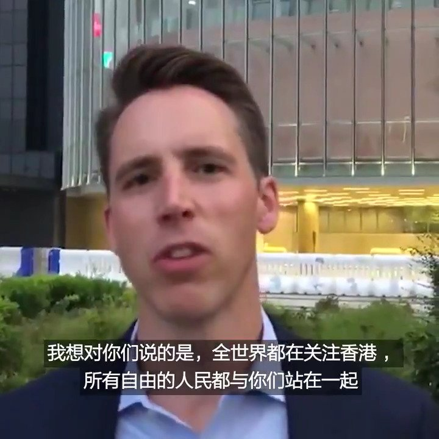

美国之音中文网 北京时间 2019-10-14T14:10:34Z 1183626130386870272 “全世界自由的人民与你们站在一起，因此我们都可以说，我们现在都是香港人”， 13日到香港的美国国会共和党参议员霍利（Senator Josh Hawley）在香港立法会前录制了一个视频，对香港抗议民众表示支持并承诺在国会推动《香港人权与民主法案》。#香港 https://t.co/Okx9xchq1Z   