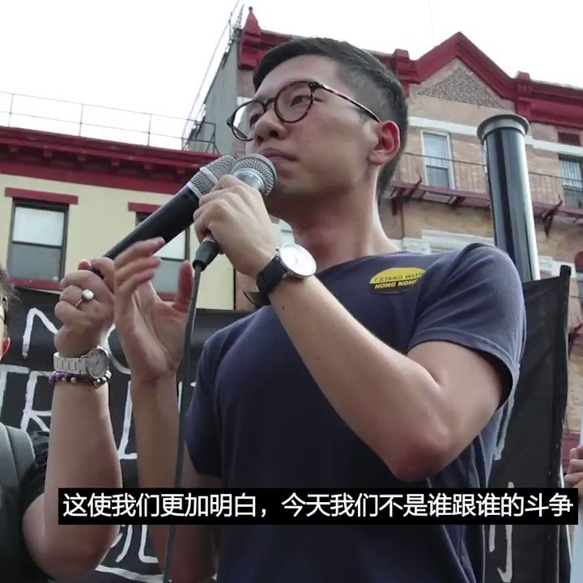

美国之音中文网 北京时间 2019-08-18T12:57:02Z 1162951514178105344 被北京攻击为“美国乱港黑手、港独头目”的香港学生领袖罗冠聪在8月17日纽约举行的支持香港的集会游行上发言，他说，“今天我们不是谁跟谁的斗争，这是强权同人民、良知和公义的斗争，这个斗争不仅属于香港人，香港人、中国人、全世界支持良知的人都可以跟我们一起。” #香港 https://t.co/EAyLjpQV43 https://t.co/iknl4scY3f   