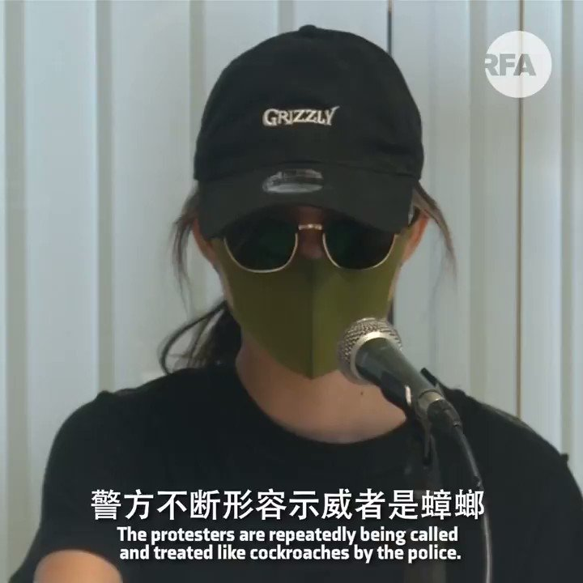

自由亚洲电台 北京时间 2019-08-12T22:38:53Z 1160923613563744258 【 “香港经历了当代历史中最黑暗的周末”】
【示威者揭示警察残暴证据】

香港警察过去两日采用的强硬手段，进一步提升武力程度，造成超过45人受伤，其中有女医护人员怀疑被警察的橡胶子弹击中眼部，右眼永久失明。
示威者召开记者会，形容香港警察的意识，可以跟二战时的希特拉相提并论。 https://t.co/zFirp25lr1   