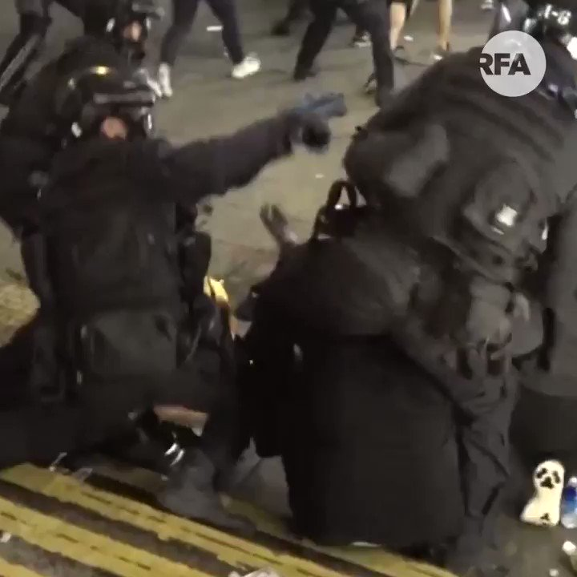

自由亚洲电台 北京时间 2019-08-11T23:24:25Z 1160572684427644928 【警察暴打已就范示威者】
【示威者受伤被捕者众多】
香港警务处早几天突然委任新一位副处长刘业成后，镇压示威者方法比之前更为进取，使用了更大武力，在尖沙咀清场行动中，多位男、女示威者倒地后，仍被警员暴打，清场行动中，更有一位女学生右眼爆裂，右眼很可能永久失明。 https://t.co/HHxc1b2vk2   