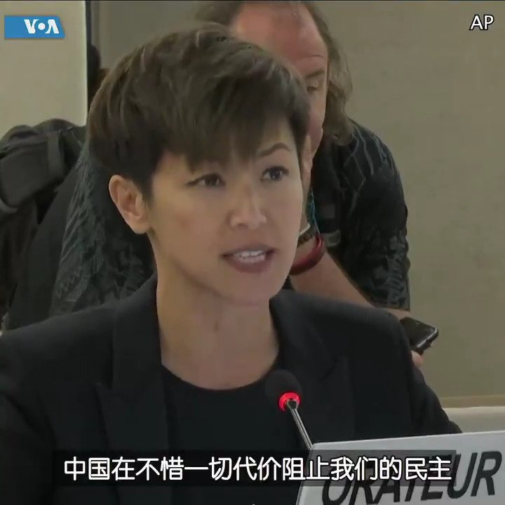

美国之音中文网 北京时间 2019-07-09T04:05:23Z 1148322208273575947 香港歌星、民主活动人士 #何韵诗 （#DeniseHo）8号在联合国人权理事会发言说两度被中国代表打断。何韵诗谈到香港两百万民众参加 #反送中 和平示威，她说主权移交后香港的民主自由被逐渐削弱，她说鉴于中国侵犯人权的行为，联合国应该将中国从人权理事会除名。
https://t.co/UjO2NUTs58 https://t.co/wXb9ikAZFE   