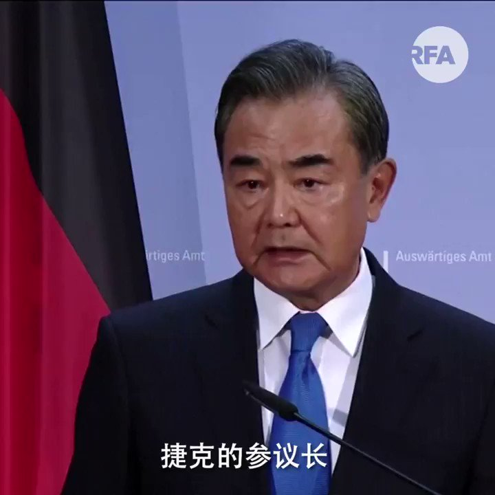

自由亚洲电台 北京时间 2020-09-02T15:21:52Z 1301057741427859457 【德国外长重击中共软肋】

王毅欧洲之行最后一站，是欧盟轮任主席国德国。德外长马斯代表欧盟，针对香港、新疆和台湾议题发声。对于王毅威胁捷克参议长将为访台"付出深重代价"，马斯反击"这里容不下威胁"

马斯又要求中方撤回港版国安法，尽快进行不受限制的立法会选举，并让独立监察团进入新疆教育营 https://t.co/4i1rrHUr8b   