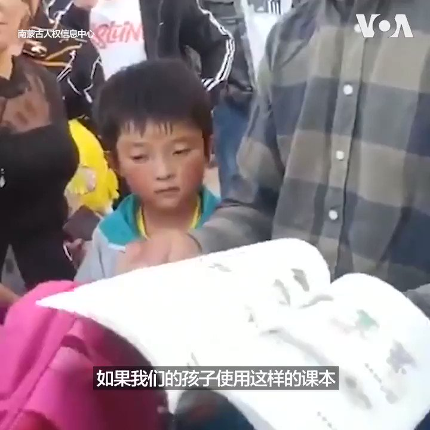

美国之音中文网 北京时间 2020-09-01T09:48:43Z 1300611511656775680 “保护自己的母语不算犯法吧？”内蒙古一位教师被警方问话时说，“以前我们学得挺好的，谁也没去造反，没去反对中华人民共和国 。”中国当局用汉语逐步取代蒙语授课的消息引发的社会动荡还在持续。“从学生、家长、教师到快递小哥，各个阶层都在抗议，这是前所未有的，”南蒙古人权信息中心主任恩和巴图说。 https://t.co/mtniWnsNRR   