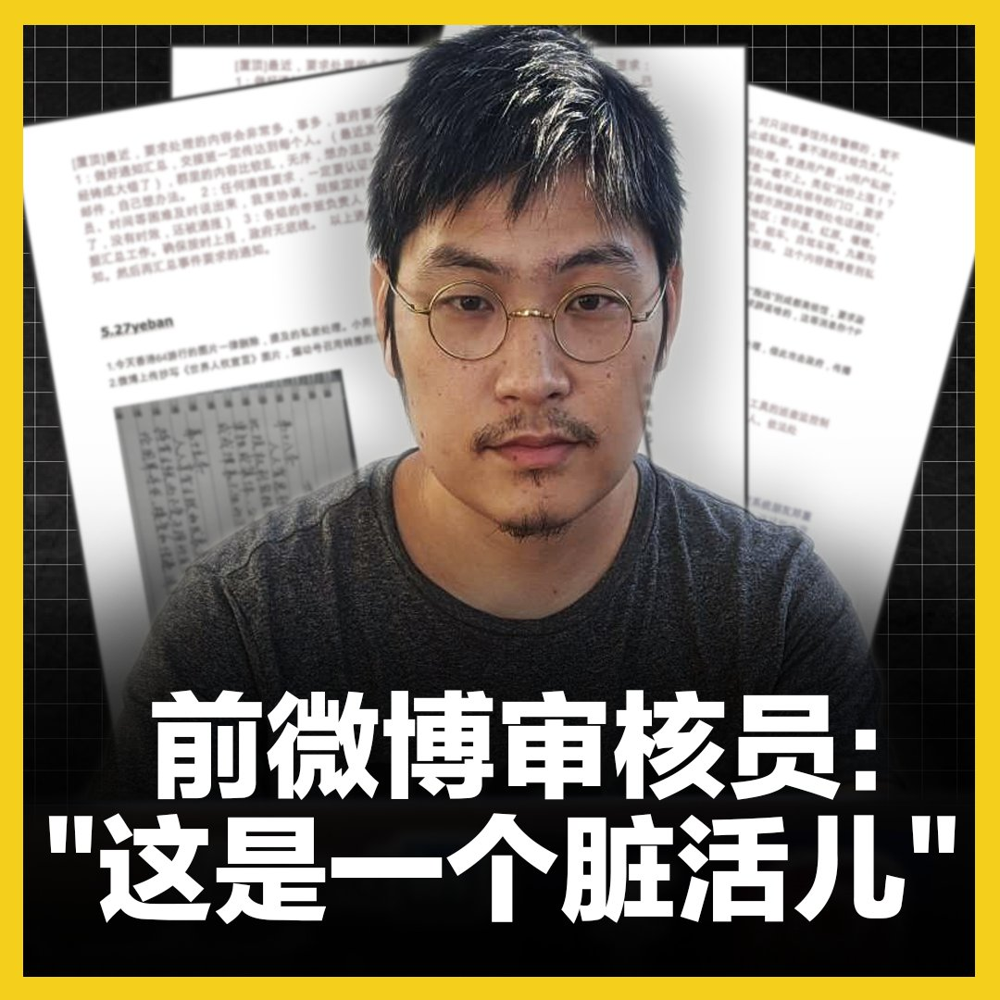

美国之音中文网 北京时间 2020-08-29T08:00:01Z 1299496993455312897 “这是一个脏活儿，”在中国互联网审查业工作十年的 #刘力朋 说。从入行第一天，他就秘密收集公司的“交班文档”，为共产党“真理部”那些荒谬的、事无巨细、朝令夕改的审查指令留下见证。他决心对抗审查体制，因为这是一个“作恶的系统”，而他，“不甘做个坏人”。
#网络审查
全文：https://t.co/ALWkOIGs4w https://t.co/wA1q6utnSg   