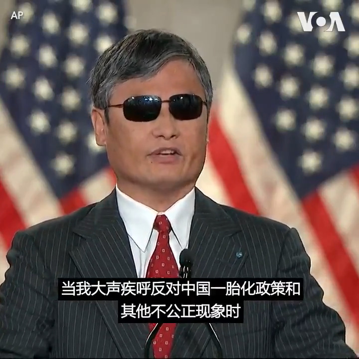

美国之音中文网 北京时间 2020-08-27T12:26:07Z 1298839185336475648 著名中国盲人维权律师陈光诚8月26日星期三应邀在美国共和党四年一度的全国代表大会上发表演讲。#陈光诚 在讲话中说，“中共是人类公敌，它正在恐吓自己的人民，正在威胁世界的福祉。” 详细报道：https://t.co/J0VGkiGoYU https://t.co/UbIAwZ4GlG   