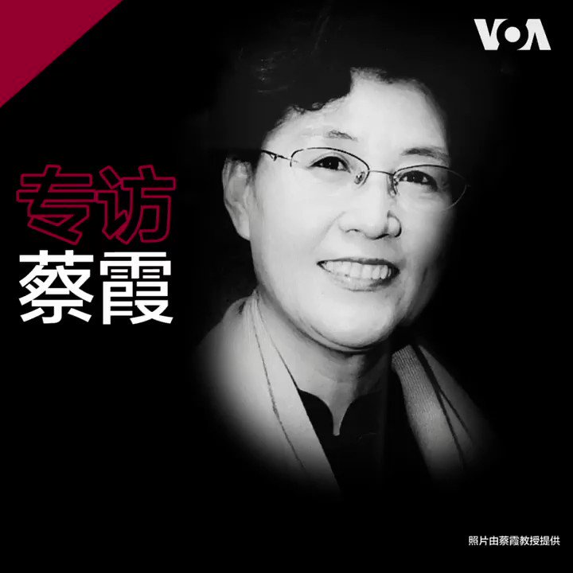

美国之音中文网 北京时间 2020-08-18T11:16:23Z 1295560146211479556 为共产党培养了近40年干部，到头来却成了最决绝的反对派。被开除党籍、取消退休待遇的前中共中央党校教授蔡霞对美国之音说，中共已成"惊弓之鸟"，下狠手打压党内异见者，全因内外交困，中国政治转型要靠体制内外精英合作，这个"僵尸政党"必须下台。
全文：https://t.co/Vx2hRUCjdY https://t.co/uK14kLg8Or   