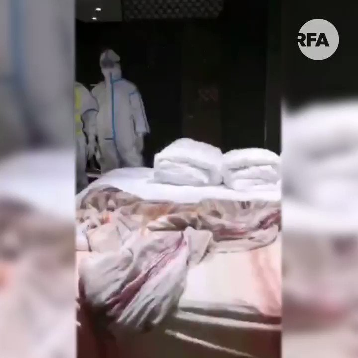

自由亚洲电台 北京时间 2020-08-18T16:51:58Z 1295644596798513152 【留学生回中国后被公安登门问话】

一名近日回中国的女留学生，在酒店隔离期间被四名公安登门约谈，指她在网上"发了一些东西"，并教训她："都是中国人，最起码要有爱国心。"

但女生未被吓怕，反呛："我在中国的媒体软件上面反映我对中国酒店的不满就是没有爱国心吗？爱国之心就是能够为自己维权！" https://t.co/2ER9YOTXDu   