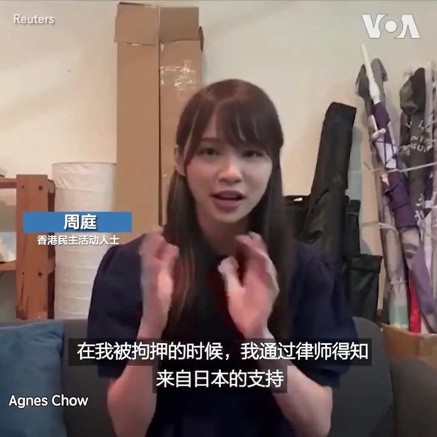

美国之音中文网 北京时间 2020-08-14T04:28:02Z 1294007826596102145 香港民主活动人士周庭12日向日本支持者表示感谢并呼吁他们继续关注香港。周庭10日与壹传媒创办人黎智英等人根据国安法被捕，12日凌晨获保释。周庭被捕在日本引发关注，日本媒体称她为”民主女神“。日本议员、前防卫大臣中谷元12日表示将继续支持周庭等香港民主人士争取自由。 
https://t.co/CH9Q0ny7xP https://t.co/7IEx1WwsEJ   