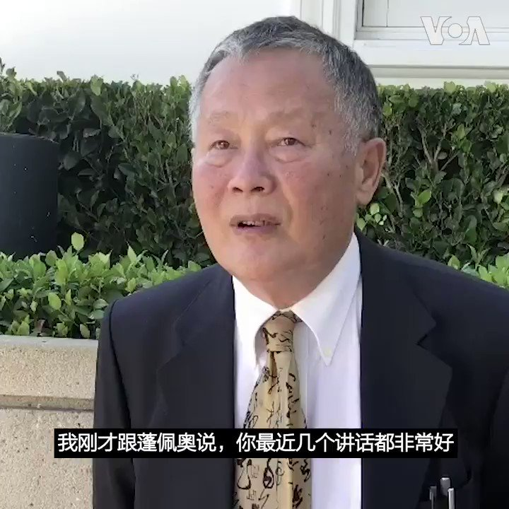

美国之音中文网 北京时间 2020-07-24T13:16:03Z 1286530563134955521 中国异议人士魏京生23日在加州尼克松图书馆对美国之音表示，他向蓬佩奥表达了有人提出怀疑，美国目前的对华政策是否会持续下去。蓬佩奥国务卿回应说“这个政策是好几个部门一起做的，而且得到两党的支持，而是要持续几十年。” 汉学家林培瑞认为现在最大的转变是不把对方叫中国，而是叫共产党。 https://t.co/3y0VsykFJm   美国之音中文网 北京时间 2020-07-24T06:52:02Z 1286433923161927681 国务卿蓬佩奥呼吁中国人民改变中共 https://t.co/sX4umovLNK   