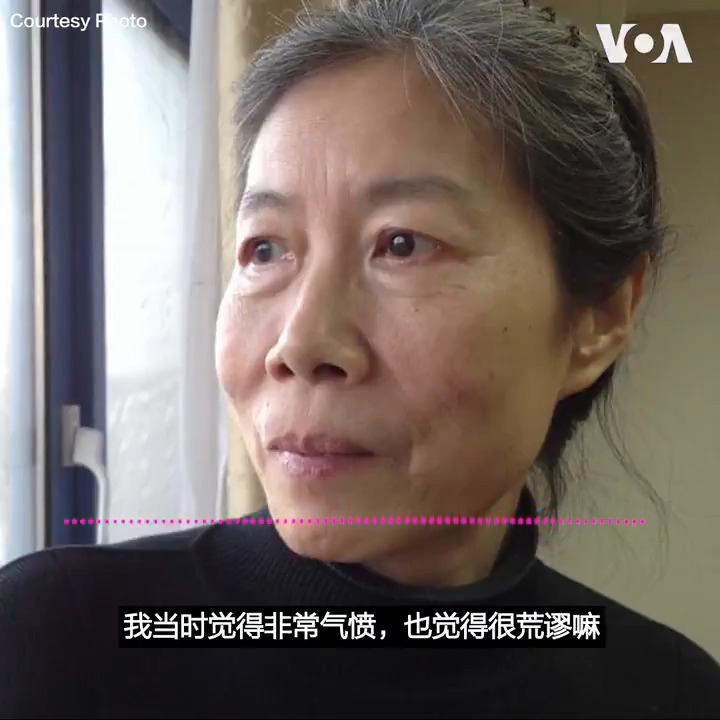

美国之音中文网 北京时间 2020-07-07T01:46:48Z 1280196514451775489 “嫖娼？嫖你大爷，”清华大学社会学系教授郭于华忍不住骂了脏话。北京时间星期一（7月6日）上午，软禁中的前清华大学法学院教授许章润被警方从家中带走，罪名是涉嫌嫖娼。 郭于华说，当局编出如此拙劣的借口，只为掩盖政治迫害。 《中国敢言批习教授许章润遭当局带走》全文： https://t.co/uP00jYxj5H https://t.co/WdwTw2BHAy   