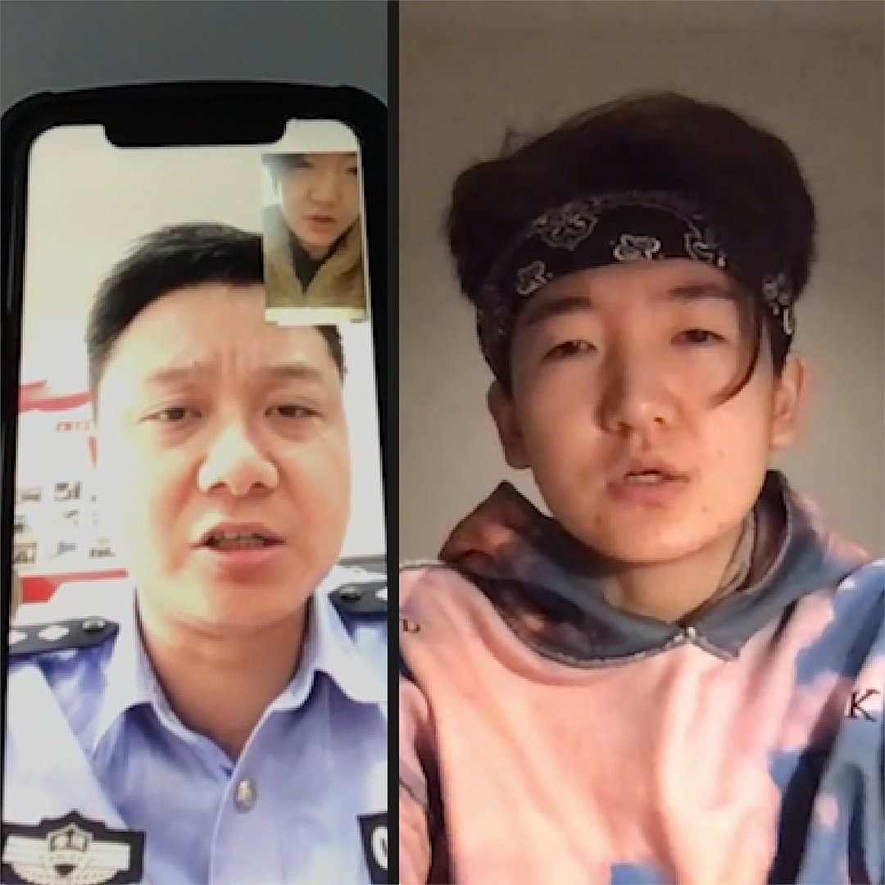

美国之音中文网 北京时间 2020-07-03T08:56:27Z 1278855085574029313 “你的很多表现已不符合中华人民共和国公民身份，” 国保在电话中对现居墨尔本的90后Zoo说。
因为发推嘲讽习近平，她的父亲多次被叫到中国南方城市的警察局“喝茶”。父母要她回国自首，别当“卖国贼”、“丧家犬”。
北京通过株连，试图实现越境言论管控的努力从未停止。
https://t.co/ARTuco513D https://t.co/WqTm0lRmf2   