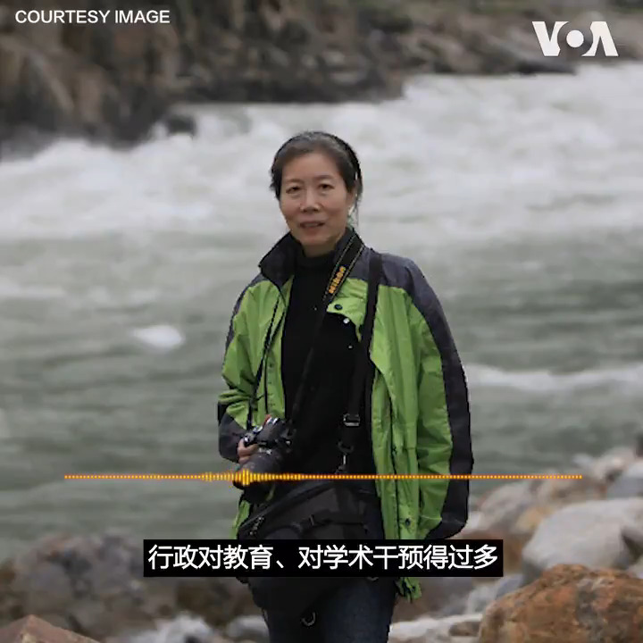

美国之音中文网 北京时间 2020-06-18T10:06:26Z 1273436882928652294 现年64岁的郭于华是清华大学社会系教授。她的学术研究主要关注中国底层社会，包括农民­­­工、失业下岗工人、劳工维权等。郭于华告诉美国之音,她的微博被封了80个号，微信被封了五个。但她还是要发声，她说，“虽然也害怕，虽然也软弱，但是我还得站着，我就不能跪下。” https://t.co/bQEJfcTWGS https://t.co/h2zZhojHtd   