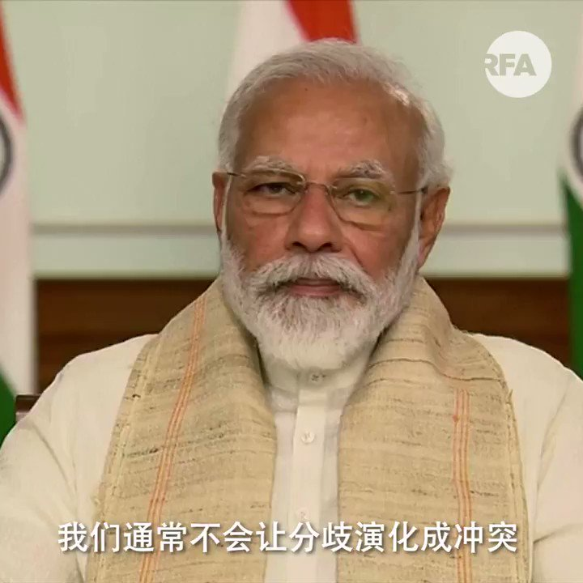

自由亚洲电台 北京时间 2020-06-17T19:31:22Z 1273216664260112384 【印度总理强硬回应中印冲突】
【 “我保证我们士兵不会白白牺牲”】

中印边境发生激烈冲突，导致数十士兵伤亡后，印度总理莫迪发表全国电视讲话，他强调印度不会作出挑衅，在主权问题上作出妥协。
莫迪更保证，印度士兵不会白白牺牲的。
#中印边境
#莫迪 https://t.co/LAc4VG4LRK   