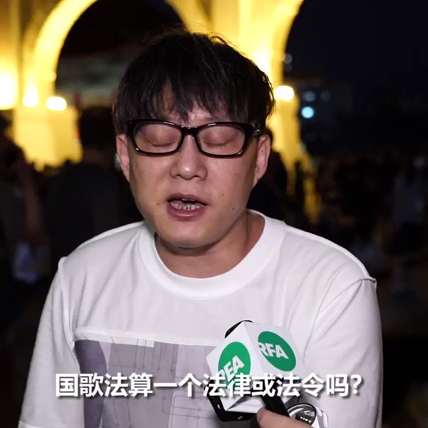

自由亚洲电台 北京时间 2020-06-05T15:16:31Z 1268803873528934400 【香港通过国歌法  林夕：走音 打喷嚏 可能犯法】
香港知名填词人林夕，六月四日晚参加在台北自由广场的纪念六四烛光晚会。他说过去很少参加维园悼念活动，今年落户台湾，看到香港以疫情限聚令禁港人悼念，因此更要参加台湾的活动。 他更用粤语高喊结束一党专政。林夕批评香港的国歌法是”人治“的法律。 https://t.co/sihqZNcBQH   