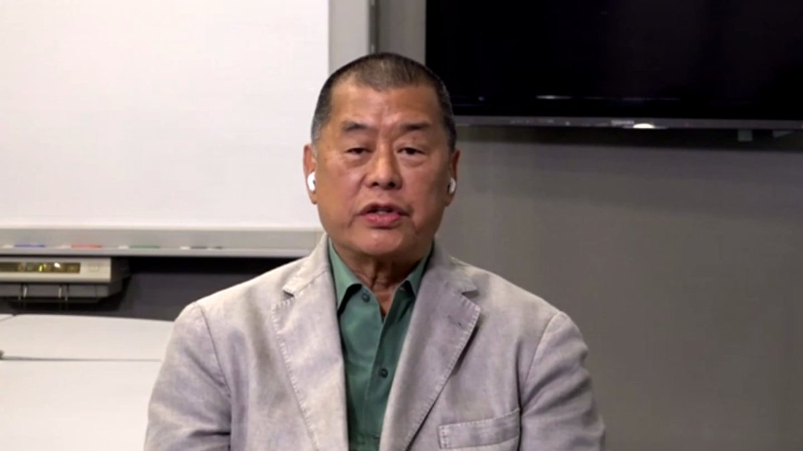

D英国广播公司BBC 北京时间 2020-05-28T20:15:08Z 1265979918959206406 香港壹传媒集团创始人黎智英接受BBC访问时指出，“国安法”一旦被强制执行，于香港便是末日，会摧毁香港的法治与自由。
他说，“没有法治，这里的生意人就得不到保护。他们能在这里做生意的唯一方法，将是贿赂那些有权控制他们的官员。” https://t.co/CfLnC0AR67   D英国广播公司BBC 北京时间 2020-05-28T02:14:17Z 1265707914456637445 【最新消息】加拿大法院就孟晚舟案作出裁定，华为公司高管孟晚舟案符合引渡的“双重犯罪”标准，她未能获释。 https://t.co/5xi3Eq5EIe   