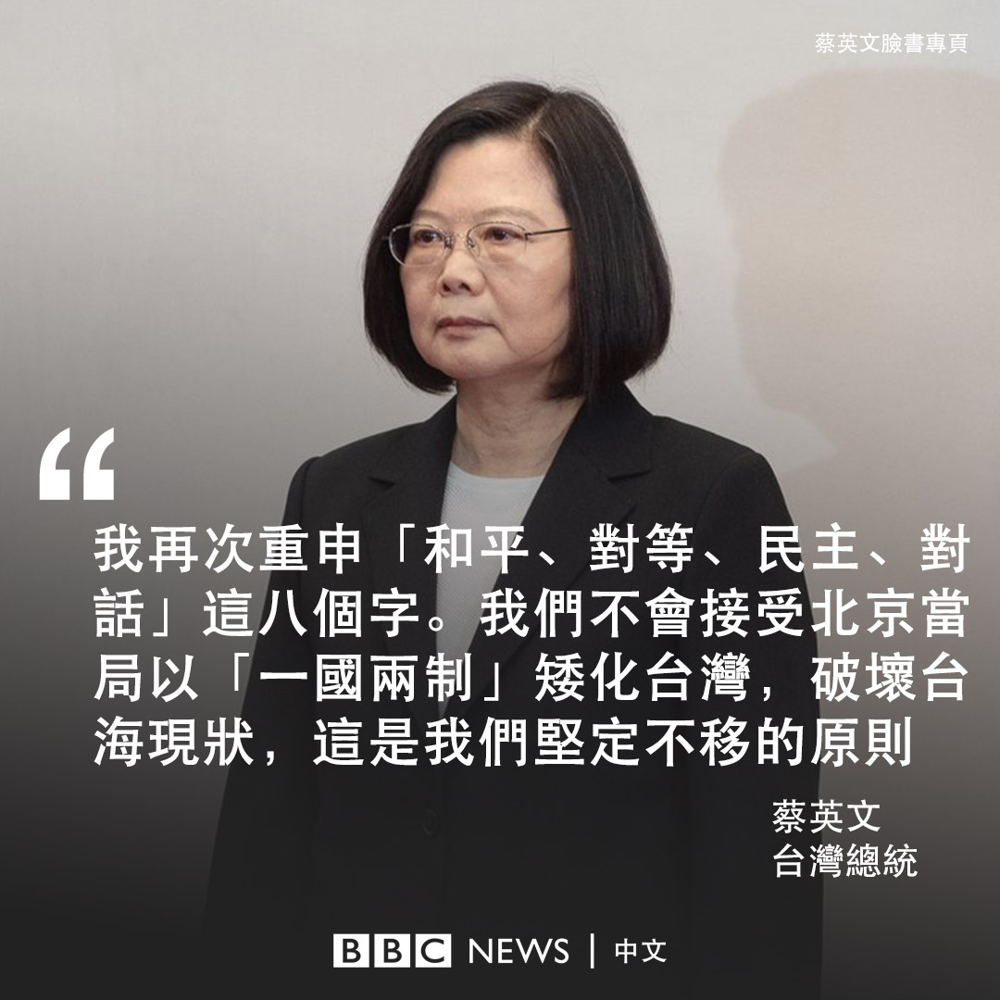

D英国广播公司BBC 北京时间 2020-05-20T11:01:05Z 1262941386497830918 【台湾总统宣誓就职】台湾总统蔡英文5月20日宣誓展开第二个任期，随后发表就职演讲。她再次重申“和平、对等、民主、对话”这八个字，并表示不会接受北京当局以“一国两制”矮化台湾，破坏台海的现状。同时她期盼中国领导人，承担起相对的责任，共同稳定两岸关系的长远发展。 https://t.co/wss0PoCy26   