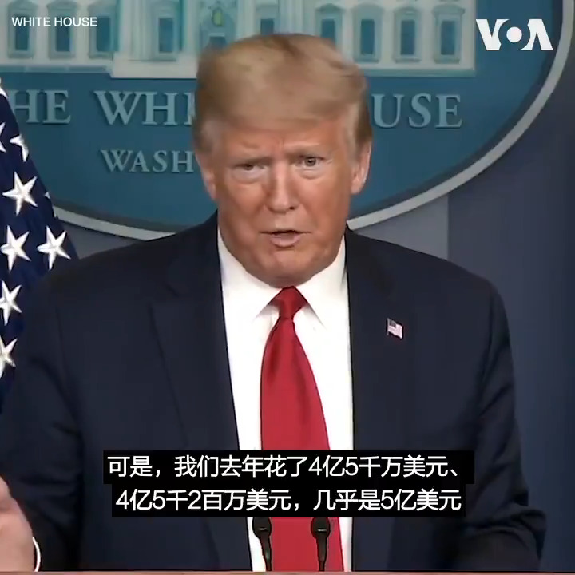

美国之音中文网 北京时间 2020-04-09T10:11:29Z 1248070999955963910 特朗普总统8日记者会上当场回复世卫总干事谭德塞当天关于更多裹尸袋及勿将疫情政治化的言论。特朗普总统说，“说起政治化，看看他们跟中国的关系，他居然说政治化，我简直不能相信。中国花了4千2百万。我们花了4亿5千万。而一切似乎都是照中国的方式。这是不对的。” https://t.co/AcuijLCysz https://t.co/ab2sgrhQ42   