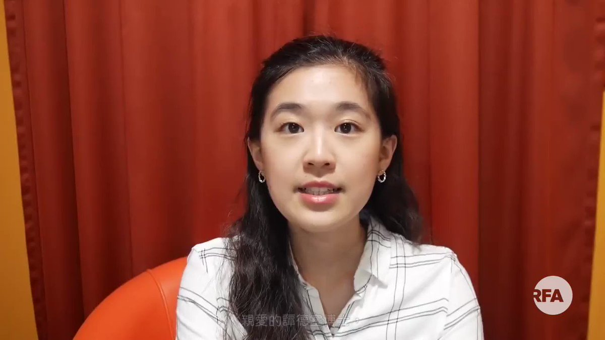

自由亚洲电台 北京时间 2020-04-09T19:50:35Z 1248216735238377473 【留英台生拍片反驳谭德塞】

世卫总干事谭德塞指控台湾对他进行人身攻击，除了点燃国际政治风波，亦引来海外台湾人不满

在英国爱丁堡大学主修传染病学的台湾学生林薇向谭德塞发出公开信，表示台湾官方从未针对谭德塞及非洲人民做出基于种族或肤色的负面评论，要求谭德塞就其不实指控道歉。 https://t.co/wjYk6i2dQ5   