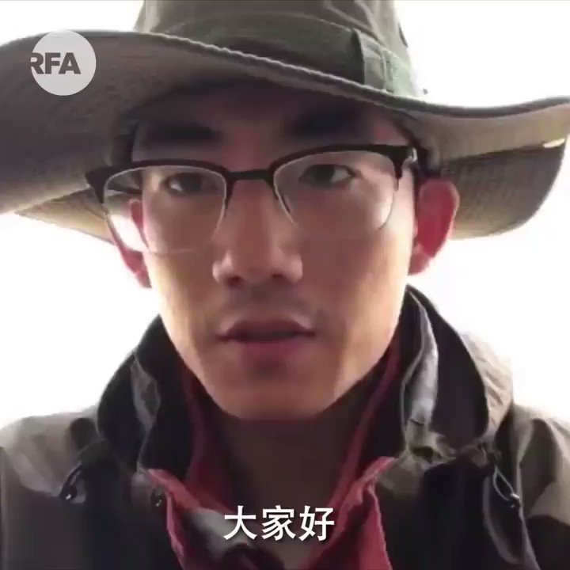

自由亚洲电台 北京时间 2020-03-31T13:40:25Z 1244862090772275201 【山东青年实名要求“习近平下课”】
【 “曾经我也是中共的小粉红”】
山东青年张文斌在网上发布视频，实名呼吁“习近平下课”、“共产党下课”，引起广泛回响。有网民把他与八九六四学生相提并论，形容他是“真英雄”。据了解，张文斌除了微信永久封禁，并以寻衅滋事“被拘留，一直失联。
#习近平
#小粉红 https://t.co/pXpeHCEtxw   