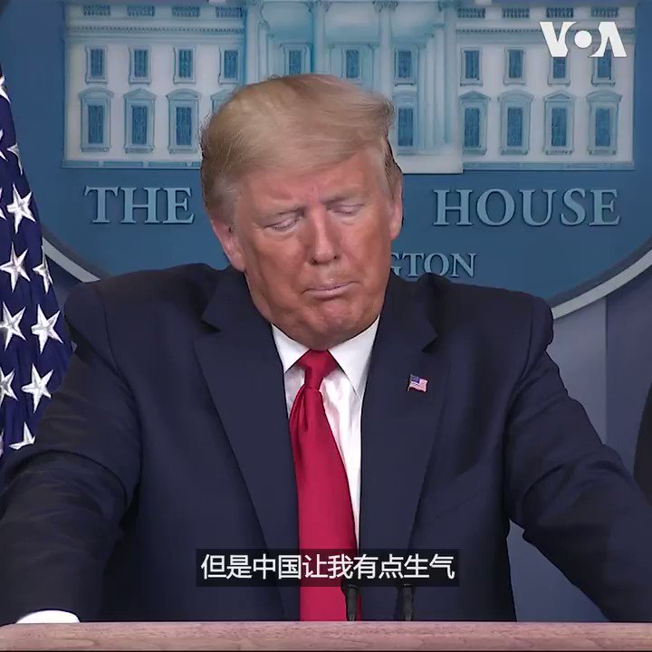

美国之音中文网 北京时间 2020-03-23T09:02:56Z 1241893155668099072 美国总统特朗普在3月22日的白宫记者会上表示，中国让他有点生气。特朗普总统说，“但是中国让我有点生气。说老实话，因为不管我多喜欢习近平主席，多尊重这个国家，钦佩这个国家...但是他们(中国)本应该把这个情况告诉我们。我确实问过他，是否可以派我们的人去中国。他们出于骄傲不愿意。" https://t.co/IiEF6IYxAe   