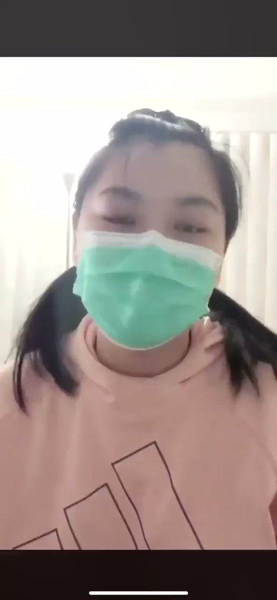

自由亚洲电台 北京时间 2020-03-22T11:23:42Z 1241566193837727744 【华裔女子发起“向美国道歉运动”】
【“连德国人也会为自己过错道歉”】

在海外有华裔女子在社交媒体上发起 #saysrytoAmerica （向美国道歉）活动。
她认为由于中国政府向全世界隐瞒疫情，最终令武汉肺炎向全球扩散，所以华人要为为将中国病毒带到美国道歉，为中国共产党及中国人所作所为感到羞耻。 https://t.co/1b1Q7er6lQ   