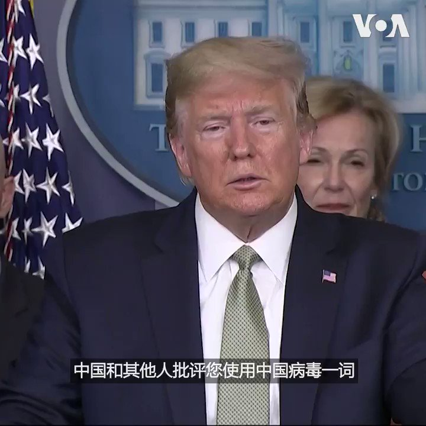

美国之音中文网 北京时间 2020-03-18T02:33:33Z 1239983224379637760 特朗普总统在3月17日白宫举行的记者会上被记者问到使用中国病毒这个词引起争议，他有何回应时。特朗普说，“中国推出不实的信息，说我们的军队把这个(病毒)传给他们，这是不实的。我决定，无须争论，我只须按照它的来源称呼它，它是从中国来的。所以我认为这是一个非常准确的术语。” https://t.co/BknTZCrogH   