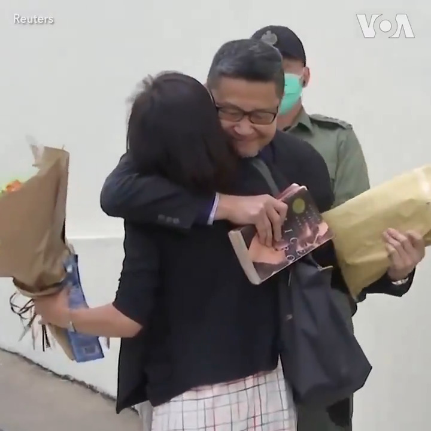

美国之音中文网 北京时间 2020-03-14T19:53:41Z 1238795432819556353 “没有一刻后悔，因为我觉得这是争取民主必须的代价”，香港占中运动发起人陈健民14日出狱对欢迎他的民众说。陈健民与戴耀廷和朱耀明同为2014年和平占中运动发起人，去年被判刑入狱。他说出狱后要做的事包括看望反送中运动被捕的年轻人。
https://t.co/VDHKxtAH9j https://t.co/4yAvkiup2R   