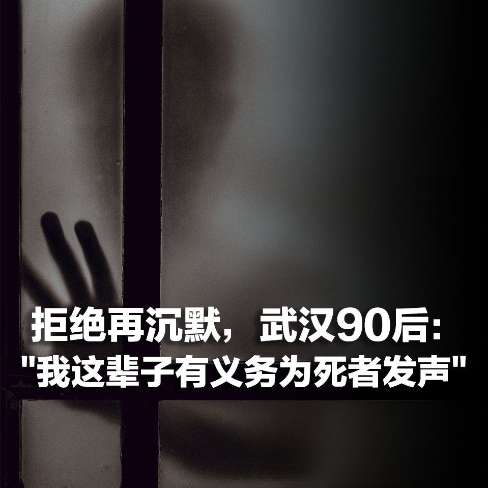

美国之音中文网 北京时间 2020-03-13T09:49:20Z 1238280954579423232 在武汉出生长大的90后屠龙一度认为，只要他不发表任何政治敏感言论，按照当局者的意愿做个顺民，像周围很多人一样，当个“精致的利己主义者”，他的人生就会一路向上。一场冠状病毒疫情彻底改变了这个想法。屠龙说，他不想再做“沉默的大多数”。(屠龙声音经过处理) https://t.co/asOBy31Tlo https://t.co/rVrHjU85uS   