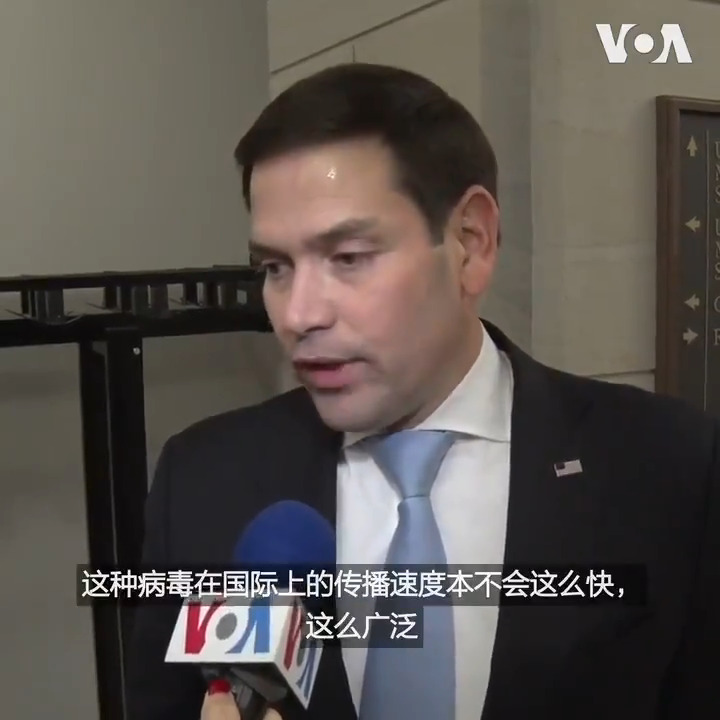

美国之音中文网 北京时间 2020-03-05T11:30:00Z 1235407184659247105 美国国会共和党参议员鲁比奥4日对美国之音表示，我想指出，我非常确定，如果中国更透明，不向各国施压，要它们不取消航班，这种病毒在国际上的传播速度本不会这么快，这么广泛。这种病毒不仅源于中国，而且我认为疫情的扩大是中国为保全自身形象而采取的行动的结果，以牺牲公共卫生为代价。 https://t.co/NKBOP3WqRe   