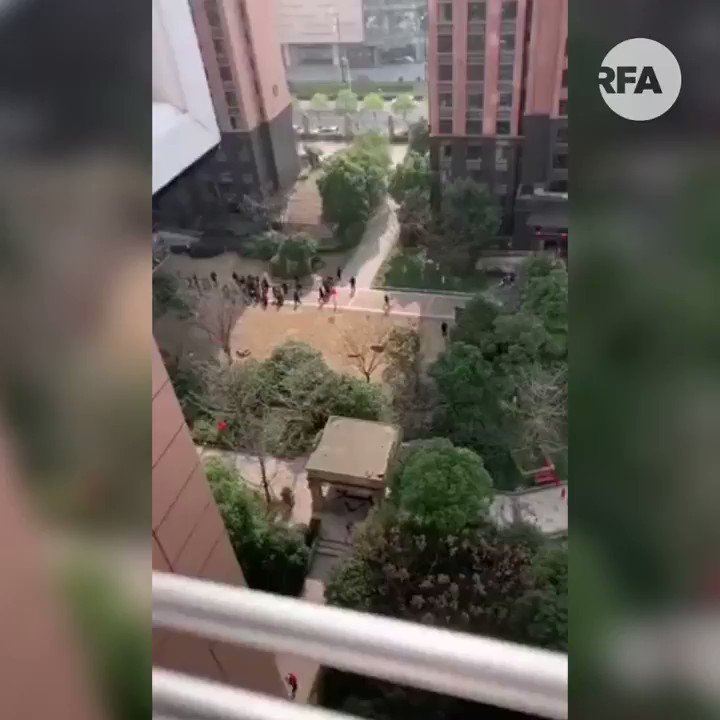

自由亚洲电台 北京时间 2020-03-05T19:59:59Z 1235535527866056705 【武汉人的呐喊】
【孙春兰巡视武汉小区】
【居民大喊 :  “全部都是假的!”】
副总理孙春兰3月5日视察武汉青山区开元公馆，接待的官员按惯例介绍抗疫工作的成绩，粮食供应充足，物价稳定。楼上的居民趁着孙春兰经过时，大叫: “这全部都是假的。”  
#首义之城
#武汉
#瞒上欺下 https://t.co/G6lLF1iWH4   