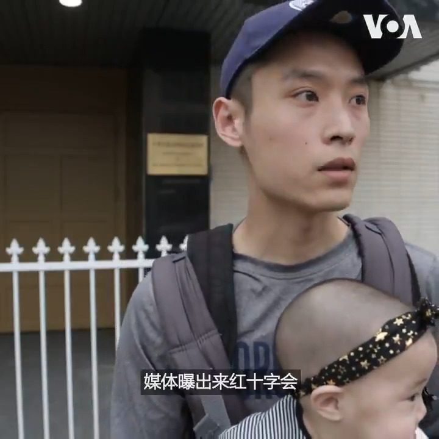

美国之音中文网 北京时间 2020-02-29T13:59:28Z 1233632859052748800 来自上海的医护人员姚嘉(化名)在接受美国之音采访时说了好几次感觉很可悲、很伤感。他说，其实平常时候很多病需要托关系才看到专家门诊或者是权威门诊，普通人看病是几乎得不到很专业的对待。这次瘟疫爆发，把这个事情扩大得更加明显、更加的赤裸裸，我觉得很悲哀。https://t.co/oNHzZuS9HT https://t.co/cqAOAqUAF1   