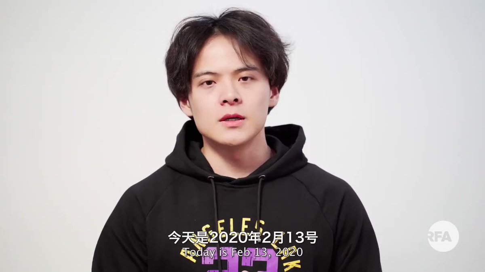

自由亚洲电台 北京时间 2020-02-27T19:12:13Z 1232986789431791617 【前央视主持人武汉揭真相后失联】

前央视主持人李泽华周三发布求救视频，表示自己正被国安追截，担心国安想抓他去隔离

他最后一条直播表示自己正被搜查，他读出宣言，表示希望中国有更多年轻人站出来，但他知道理想主义，“在那个春夏之交已经破灭”

他之后开门，两人进屋，直播中断，他至今失联 https://t.co/voCA9yAcib   