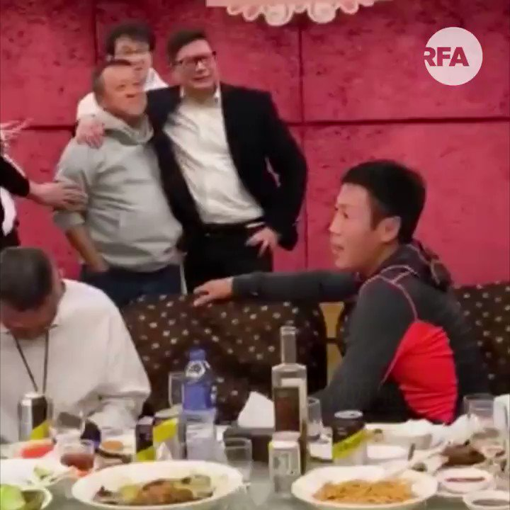

自由亚洲电台 北京时间 2020-02-17T19:08:24Z 1229361951718817792 【香港“一哥”和成龙、曾志伟等人饭聚】

网络流传片段，香港警务处处长邓炳强，和一众艺人饭聚，包括成龙、谭咏麟、曾志伟、方中信等人。邓炳强发表感言，感谢警队兄弟的支持，又说自己做警察，“是学成龙大哥、方中信”。他又说和演艺朋友都是老友，“只要你给我们竪起大拇指，我们赴汤蹈火、在所不辞！” https://t.co/CVRh1t4So5   