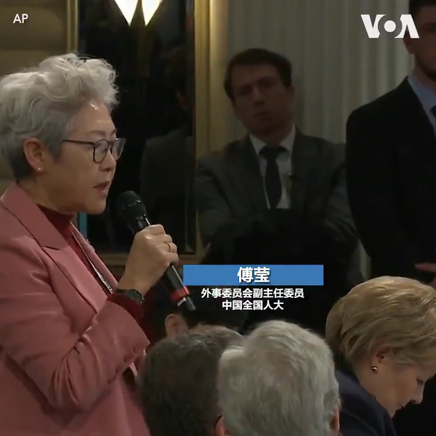

美国之音中文网 北京时间 2020-02-15T07:25:11Z 1228460207354806274 美国众议院议长南希·佩洛西2月14日在德国呼吁各国在建设5G网络时远离中国电信巨头 #华为 。中国人大外事官员傅莹当场反驳佩洛西说，一家华为公司就引起畏惧，难道西方民主制度如此“脆弱”？佩洛西回答说：“我们不想模仿中国的制度”。 https://t.co/GOg3v9Dymg https://t.co/YbcD6Ivuqb   