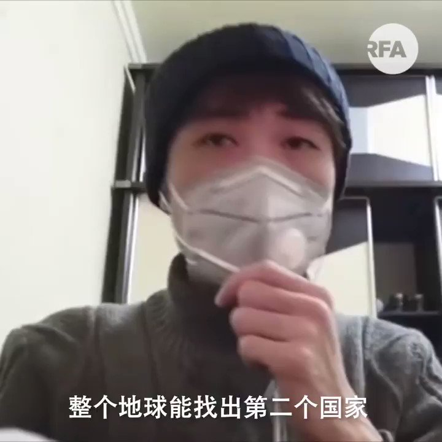

自由亚洲电台 北京时间 2020-01-26T16:00:43Z 1221342188614737920 【武汉人的呐喊】
【“地球能找出第二个政府像这样搞吗?”】
【“我们都太了解这个国家是什么性质”】
北京决定把 #武汉 城封销起来后，物资供应跟不上，一千多万武汉居民坐困愁城。
一位武汉青年终于按捺不住，冒着被公安拘禁的危险向外界求助，他直接批评政府一开始便隐瞒疫情，不理会武汉市民死活。 https://t.co/kyCF0jJExT   