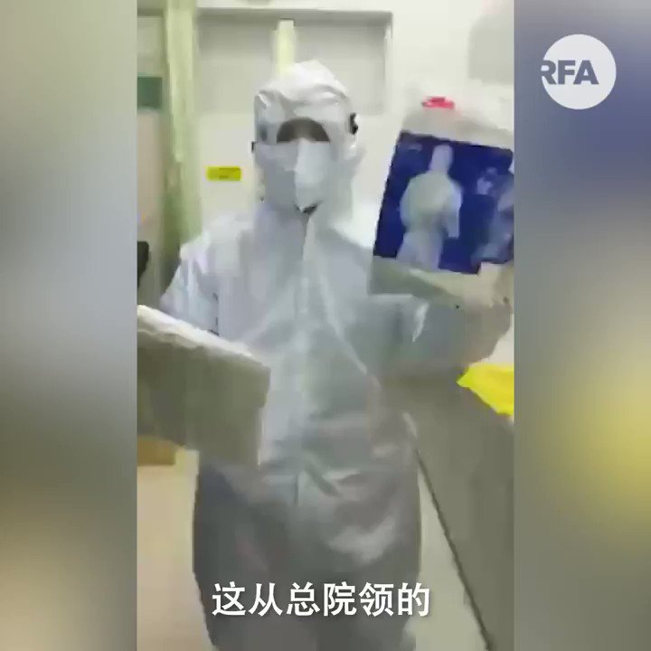

自由亚洲电台 北京时间 2020-01-26T14:18:10Z 1221316381452328961 【武汉医护投诉政府防护用品质量差劣】
 【 “口罩都是假的!”】
武汉各大医院连日来物资告急，在巨大压力下，市政府提供了新一批防护用品，但医护人员早上拿来一看，才发现全是劣质产品，连 “口罩都是假的!”。
#武汉
#医护告急
#豆腐渣 https://t.co/jMnK6JiF2k   自由亚洲电台 北京时间 2020-01-26T16:00:43Z 1221342188614737920 【武汉人的呐喊】
【“地球能找出第二个政府像这样搞吗?”】
【“我们都太了解这个国家是什么性质”】
北京决定把 #武汉 城封销起来后，物资供应跟不上，一千多万武汉居民坐困愁城。
一位武汉青年终于按捺不住，冒着被公安拘禁的危险向外界求助，他直接批评政府一开始便隐瞒疫情，不理会武汉市民死活。 https://t.co/kyCF0jJExT   