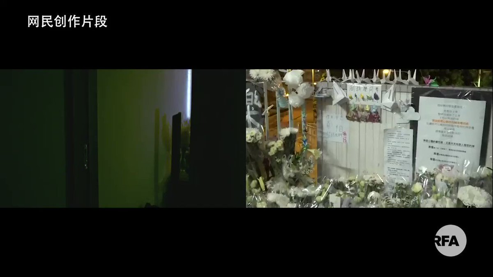

自由亚洲电台 北京时间 2020-01-08T16:25:18Z 1214825393506512896 【蔡英文竞选文宣憾动港、台人心】
蔡英文竞选团队周一发布宣传片《大声说话》，到第二日已有网民为影片 “加料” ，新名字是《大声说话－两个世界版》，影片在港、台两地疯传。
美国《纽约时报》记者Mike Forsythe形容：“这是我看过最有力量的政治广告，台湾总统为她的连任做出了强烈论据”。
#蔡英文 https://t.co/80FFgVnFoP   