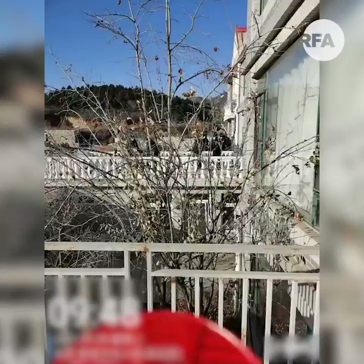

自由亚洲电台 北京时间 2021-01-05T17:30:00Z 1346388469577256960 【北京香堂村强拆 女公安同遭殃】

周二一名女警察发布片段，显示强拆队如何破门而入，她怒斥："我连自己的村都保护不了，我怎么保护人民的财产？"强拆队以广播回应："拒不执行和阻碍行为涉嫌违法，将移交公安"

对峙期间，背景响起了习近平的"抗美援朝"讲话─"中华民族是吓不倒、压不垮的" https://t.co/tfeK14bu2J   