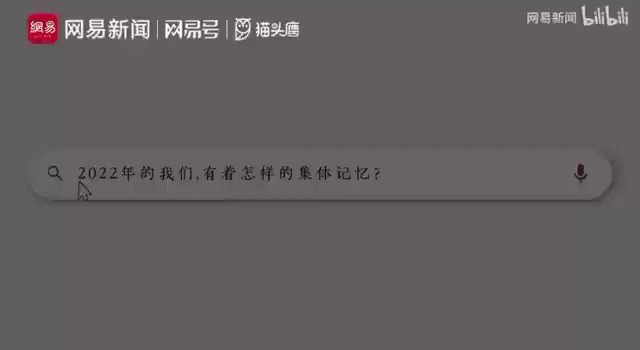

自由亚洲电台 北京时间 2022-12-30T14:24:06Z 1608710502498332673 【#网易 “#致敬每一个扛住了生活的平凡人”视频热传 遭删除】
网易年度新闻列入各地封城、疫情下亲人死去、病人得不到救助等众多片段，以及唐山打人、铁链女等，六分钟视频在网上热传，遭网管删除。视频写道:“人不是活一辈子，不是活几年几月几天，而是活几个瞬间。致敬每一个扛住了生活的平凡人。” https://t.co/kdog7fo81R   