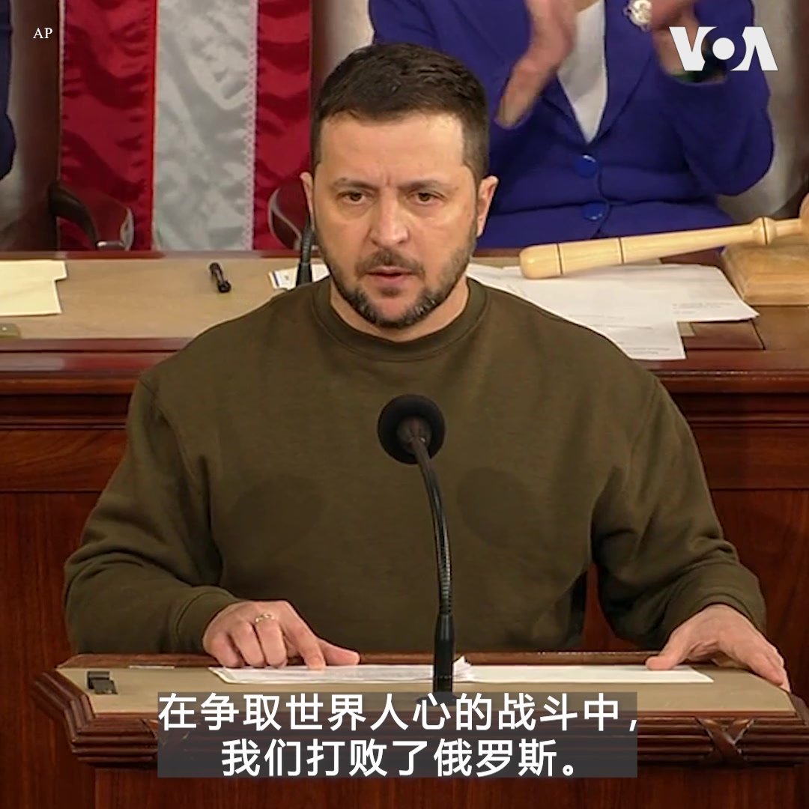

美国之音中文网 北京时间 2022-12-22T11:43:24Z 1605770956202332162 “虽然有各种悲观绝望的预设，乌克兰没有倒下。乌克兰还在顽强地活着，”乌克兰总统泽连斯基12月21日晚间在美国国会参众两院联席会议上发表演讲时说。两党议员在他讲话中多次起立报以热烈掌声。泽连斯基说：乌克兰永远不会投降！https://t.co/6noA1CSTep https://t.co/WhhAH5fANa   