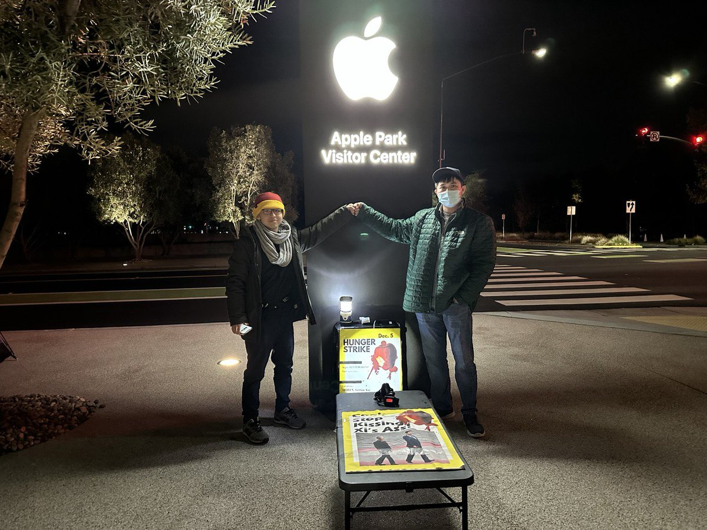

美国之音中文网 北京时间 2022-12-07T07:01:21Z 1600264158163140608 两名中国年轻人周一开始在加州苹果公司总部前绝食，抗议其协助北京言论审查、压迫人权。“白纸革命、彭立发事件让我们有勇气站出来，” 留学生王涵说。“我们在海外把这个火给接上，不要让它从此断绝，”IT创业者VK说。他们致信苹果CEO：天安门屠杀后，这个机会我们等了33年。我们需要你的帮助来打这场仗。 https://t.co/Dcl4d2Ebu4   