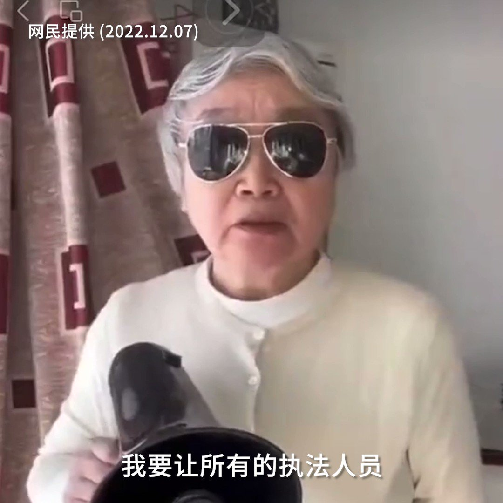

自由亚洲电台 北京时间 2022-12-07T15:42:05Z 1600395205227970561 【原中国副总理长女手持菜刀抵制防疫】

12月6日，在海外社交媒体上一段影片热传，引起网民关注。影片中，据称中国前副总理谢富治长女谢小沁（又名“刘小沁”）公开反对极端防疫，她手持两把菜刀誓死抵制入户消杀，并称如果“大白”强迫她去方舱隔离，她将“来一个砍一个”。

#过度防疫
#谢小沁
#谢富治 https://t.co/quxHHdntTx   