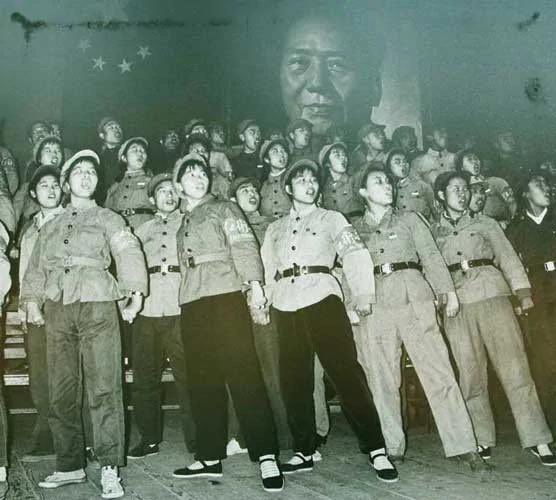

Ivy未央 北京时间 2022-12-02T10:03:36Z 1598498083377135618 转）在文革中，广西武宣县国家干部职工有113人吃过人肉、人心、人肝。贵县农民陈国荣路过武宣县去赶墟，因长得胖，被一民兵营副营长叫民兵把他活活杀害，挖出心肝，20人每人分了一块肉。
女民兵班长陈文留，她一个人吃了6副人肝，还割下5名男人的生殖器泡酒喝，说是“大补”…… https://t.co/8PU5D1RdWb   