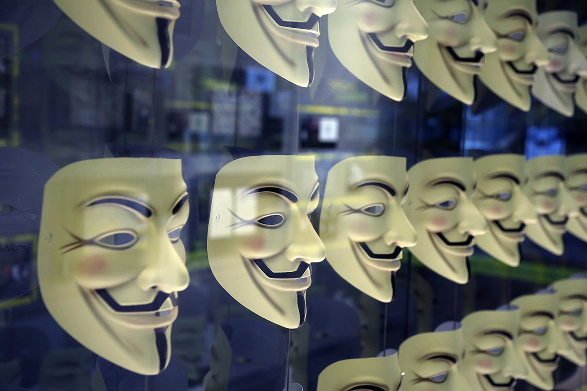

自由亚洲电台 北京时间 2022-12-02T12:01:44Z 1598527813572861953 #白纸运动 被捕者信息：

#李康梦，南京传媒学院举白纸抗议， 11月30日被捕，目前失联

景雪琴（网名：李笑笑），因参与游行失踪，家住武汉恒大御景湾。11月28日晚11：30分，被不知名警察带走

秦超，安徽六安人。11月27日晚在上海乌鲁木齐路被警察带走（十点左右失联）

https://t.co/MSBdpbFBzw   自由亚洲电台 北京时间 2022-12-02T00:54:57Z 1598360009976397824 黑客组织出手了！
名为“#匿名（#Anonymous）”的国际黑客组织周四宣布开展“#白纸运动”，攻击了多个中国政府网站，还黑入了警方监视器，公布了上海国安局长 #黄宝坤 的身份证信息。
https://t.co/KeouFmfWxA https://t.co/IN5NV1DyCs   