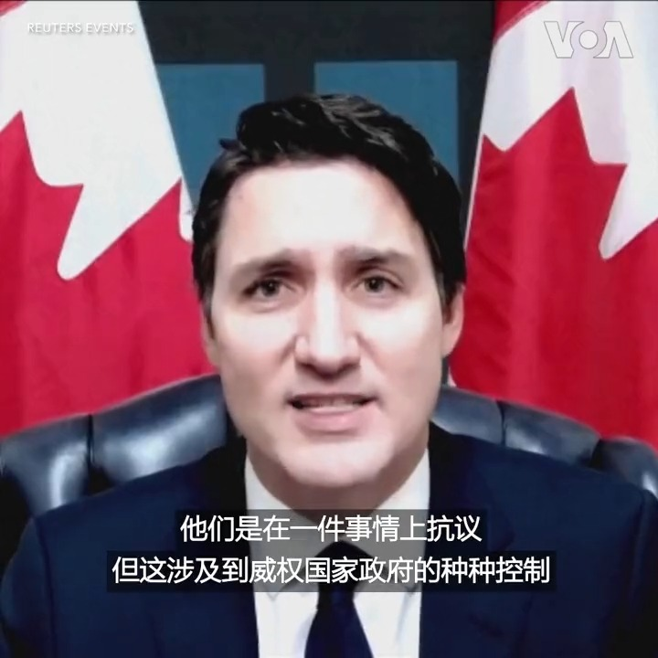

美国之音中文网 北京时间 2022-12-01T01:49:03Z 1598011237513633794 加拿大总理特鲁多11月30日表示，加拿大与中国反对新冠封控措施的抗议者同在。他说，加拿大政府正在“密切关注”中国抗议。他还说：“公民能够表达自己的意见至关重要。”连日来，乌鲁木齐居民楼失火事件所触发的悼念活动和反封控抗议已蔓延至中国多座城市，有迹象显示中国已开始放松防疫限制。 https://t.co/f7lWRctets   