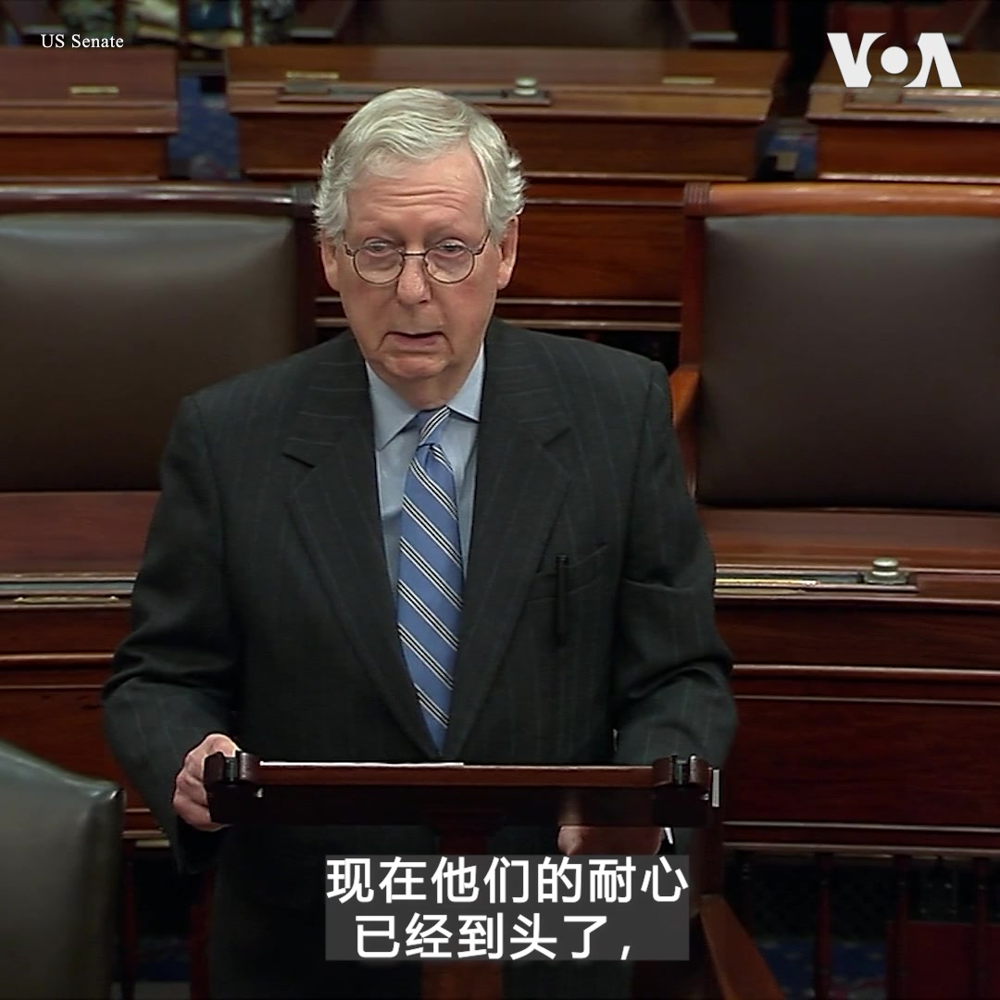

美国之音中文网 北京时间 2022-11-30T13:32:00Z 1597825752526888961 在中国多个城市遍地开花的“白纸革命”持续引起美国国会的强烈关注。“中国人民进行了一场自1989年天安门事件以来范围和规模最大最广的抗议活动，”参议院共和党领袖麦康奈尔11月29日在参议院院会致词时说。麦康奈尔严厉批评中国共产党奉行的“清零”政策不仅是可怕的压制政策，也毫无效果。 https://t.co/3whLRaQqbb   