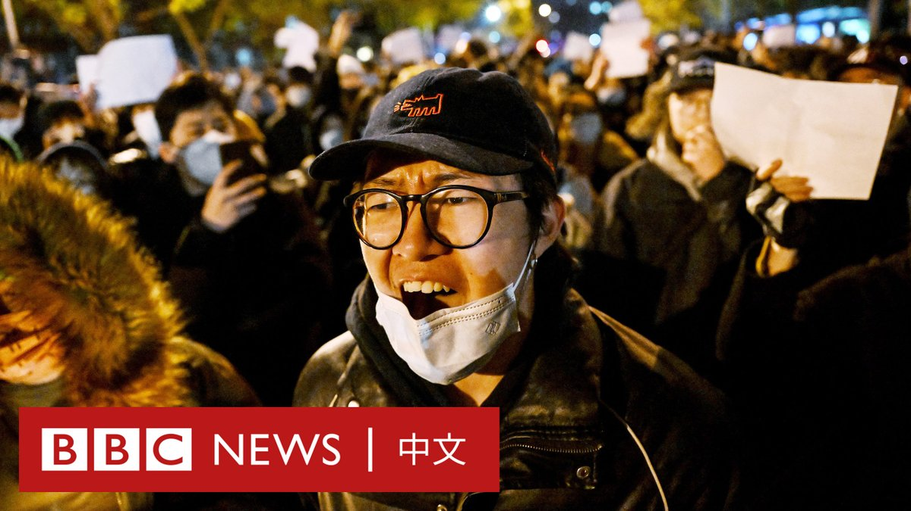
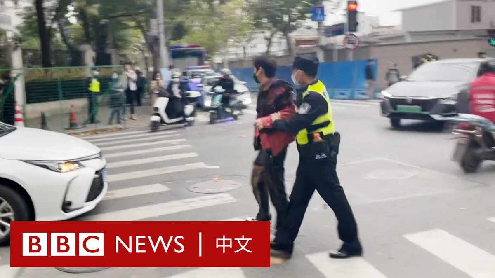

D英国广播公司BBC 北京时间 2022-11-29T20:00:06Z 1597561035195654144 中国当局正采取强硬行动，试图扑灭多地因新冠疫情限制措施而引发的抗议活动。这场示威不仅显示民众对严厉封控政策的不满已接近临界点，更对刚开始第三任期的中共总书记习近平带来重大挑战。

BBC记者麦笛文 @StephenMcDonell 在北京报道。 https://t.co/b9ISuCeK9p   D英国广播公司BBC 北京时间 2022-11-29T01:50:05Z 1597286721598947328 “这是我们的职责。”一名抗议者说。

在过去的一个周末，反对疫情封锁的抗议蔓延中国各地，包括平时严密戒备的首都北京。这些抗议者为什么要走上街头？ https://t.co/5mqOegyW9m   D英国广播公司BBC 北京时间 2022-11-29T18:48:51Z 1597543105342980097 联合国呼吁中国当局尊重自由抗议的权利，不要因和平抗议而拘留民众，欧美多国也分别作出回应。https://t.co/l6Hz1gGmOE   D英国广播公司BBC 北京时间 2022-11-29T12:47:20Z 1597452124547387394 在上周末的抗议后，中国上海警察对行人的手机进行检查，要求他们删除在示威地点拍摄的影片或照片。BBC看到至少有两人被警方带走。 https://t.co/hvXvwmZvHf   